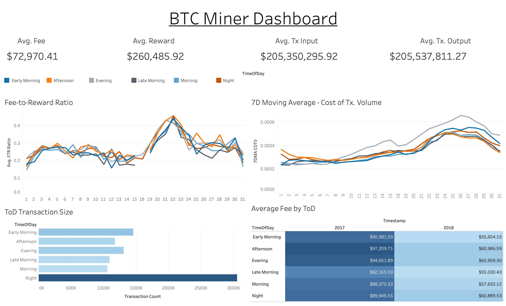

# Introduction
Welcome to the BlockChain Visualization project! This project aims to visualize the 
blockchain data in a more intuitive way. The project is divided into two parts: the 
backend and the frontend. The backend is responsible for fetching the blockchain data 
and processing it, while the frontend is responsible for visualizing the processed data.
The front-end consists of Tableau dashboards that visualize the blockchain data. 
The back-end is a Python script that fetches the blockchain data and is stored inside
a MongoDB Atlas instance. 

## Collecting the Data
The data is collected using the `pipeline.py` script. The script fetches the data from
the [blockchair.com](https://www.blockchair.com) API. The data is then stored in a MongoDB
Atlas instance. Currently, the script does not run automatically, but the feature will be
added in the future.

## Visualizing the Data
The data is visualized using Tableau dashboards. The current version of the dashboards
looks like this:

## Collaborators
Currently, the project is not open for collaboration. However, the project will be open
in the near future to allow for more contributors and added functionality.